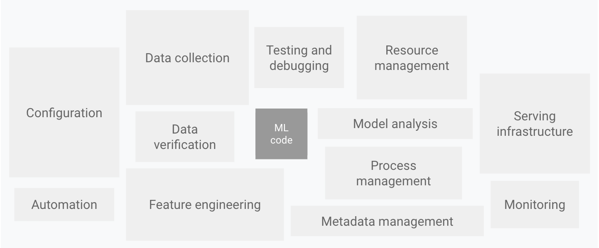

<h1 style="text-align: center">SOFTWARE DEVELOPMENT</h1>
<h1 style="text-align: center">FOR</h1>
<h1 style="text-align: center">MACHINE LEARNING</h1>

<div style="text-align: center">

## *Rahul Dave*

</div>

---


---


---

## What goes into a machine-learning project?

| | |
|---|---|
| Design | <u>Setup</u>, Product, <u>Systems</u> |
| Data | Preparation, Exploration, Preprocessing, Distributed |
| Model | Training, Tracking, Tuning, Evaluation, Serving |
| <u>Developing</u> | <u>Scripting</u>, <u>CLI</u> |
| Utilities | Logging, <u>Documentation</u>, <u>Styling</u>, <u>Pre-commit</u> |
| <u>Testing</u> | <u>Code</u>, Data, <u>Models</u> |
| Reproducibility | <u>Versioning</u> |
| Production | <u>Jobs & Services</u>, <u>CI/CD workflows</u>, Monitoring, Data engineering |

9/26 lessons aspects are model and data. The rest is engineering.

---

## The ML code is a small box



Google Cloud, *MLOps: continuous delivery and automation pipelines in machine learning*, after Sculley et al., *Hidden technical debt in machine learning systems*, NeurIPS 2015

---

## What goes into writing software?

| | |
|---|---|
| Source | Version control, Code review |
| Environment | <u>One known Python</u>, <u>every dependency pinned</u>, <u>one way to run anything</u> |
| Code | <u>A package</u>, <u>a command-line interface</u>, <u>types</u>, <u>docstrings</u> |
| Quality | <u>Formatting</u>, <u>linting</u>, <u>type checking</u> |
| Tests | <u>Unit tests</u>, <u>property tests</u>, <u>integration tests</u>, <u>system tests</u>, <u>coverage</u> |
| Documentation | <u>Reference built from code</u>, <u>guides</u>, <u>a site</u> |
| Automation | <u>Hooks on dev</u>, <u>continuous integration</u>, <u>builds</u> |
| Shipping | <u>Containers</u>, packaging for others, releases, deployment |
| Running | Logging, monitoring, someone on call |

A machine-learning project is a software project with model and data in it.

---

## Today

- A skeleton project, a justfile, one environment from one lockfile. **uv**, **just**
- The contract for the model, `api.py`, five sample requests, and the tests. **pydantic**, **pytest**, **pytest-cov**
- A formatter and a linter **ruff**
- `just check` with a coverage floor, additional linters for the config files, and a git hook. **pre-commit**, **yamllint**, **validate-pyproject**
- `babykev docs`: the code's own documentation, as Markdown and as a site. Then every function documented. **docments**, **Quarto** . For humans and agents.
- The model, `model.py`; a smoke run on the real model; a tiny model for the tests; a type checker. **torch**, **transformers**, **peft**, **hypothesis**, **ty**
- The mask's rule as property tests, the bug they find, the one-line fix, ty in the gate, two guide pages
- The dev image and the run image from one Dockerfile, a linter for it, and the first end-to-end test in pytest: the smoke on the real model, kept out of `just test`. The site published. **Docker**, **hadolint**

---

# babykev

A small model that makes decisions, and the project built around it.

- the code is taken from `kev`, a decider model with a special head to make it work like `jev`.
- We start from kev's first commit: about 830 lines that work, with no tests, no types and no docs
- We rebuild it in steps, a few files at a time
- At each step a new tool arrives, we learn about it and run it
- we incorporate the tool into a uniform interface, in the `Justfile`

There is a second tutorial example which uses docker through and through, which will be released later today.

---

## The second example: the cheese app


[github.com/dlops-io/cheese-app-ci-cd](https://github.com/dlops-io/cheese-app-ci-cd)

A FastAPI app in Docker, with linters, formatters, tests and pre-commit hooks.

---

## One request, one answer

```yaml
state: "Roquefort is a semi-soft, blue-veined cheese from France. It tastes sharp, tangy and salty."
questions:
  milk:       {type: choice, criteria: {cow: …, goat: …, sheep: …, buffalo: …, mixed: …}}
  vegetarian: {type: noul}      # yes or no
  intensity:  {type: score, criteria: [mild, medium, pronounced, strong]}
```

```yaml
milk:       {choice: sheep, confidence: 0.81}
vegetarian: {noul: 0.08}
intensity:  {score: 2.7}
```

Every answer is a probability. No text is generated.

---

## A model that decides


Questions are not allowed to see each other.

---

## You install three tools. The project installs the rest

| Tool | For |
|---|---|
| **uv** | Python itself, every dependency, running the program |
| **just** | The project's tasks: `just` lists them |
| **Quarto** | The documentation site, from step 04 |

Everything else (pydantic, pytest, ruff, pre-commit, torch, ty, hadolint, etc) comes from the lockfile, 
through `just setup`.

---

## Where we start: kev's files, one at a time

| File in kev's first commit | Lines | What it does | Arrives at |
|---|---|---|---|
| `api.py` | 111 | The contract: what a request and an answer look like | step 01 |
| `model.py` | 101 | Packing, the mask, the pointer head | step 05 |
| `data.py`, `train.py`, `evaluate.py` | 446 | Training records, the loop, accuracy and calibration | class on training |
| `serve.py` | 170 | Inference | class on ci/cd with github actions |
