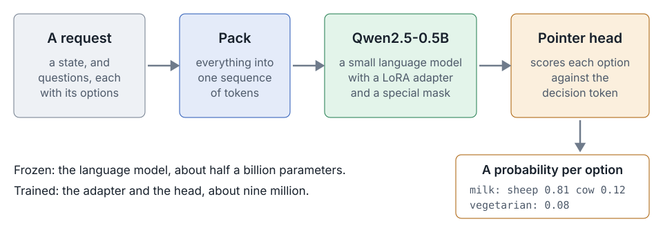

# babykev

A small model that makes decisions, and the project built around it.

- We start from kev's first commit: about 830 lines that work, with no tests, no types and no docs
- We rebuild it in steps, one commit and one tag each, a few files at a time
- At each step a tool arrives, we run it, and the next step holds what it found

---

## One request, one answer

```yaml
state: "Roquefort is a semi-soft, blue-veined cheese from France. It tastes sharp, tangy and salty."
questions:
  milk:       {type: choice, criteria: {cow: …, goat: …, sheep: …, buffalo: …, mixed: …}}
  vegetarian: {type: noul}      # yes or no
  intensity:  {type: score, criteria: [mild, medium, pronounced, strong]}
```

```yaml
milk:       {choice: sheep, confidence: 0.81}
vegetarian: {noul: 0.08}
intensity:  {score: 2.7}
```

Every answer is a probability. No text is generated. (The numbers here are for illustration.)

---

## A model that decides



---

## The steps of this lecture

| Step | What arrives |
|---|---|
| 00 | The project, empty: a README, `pyproject.toml`, a command with only `help`, a justfile |
| 01 | The contract, `api.py`, and its tests. Two fail |
| 02 | The formatter and the linter, and the two fixes |
| 03 | What they found, fixed. `just check`, and a git hook that runs it |
| 04, 04b | Documentation from the code: `babykev docs`, a site. Then every function documented |
| 05, 05a | The model, its tests, a smoke run. Then the tests that could tell it was wrong |
| 05b | Two images, so it runs the same on any machine with Docker |

---

## You install three tools. The project installs the rest

| Tool | For |
|---|---|
| **uv** | Python itself, every dependency, running the program |
| **just** | The project's tasks: `just` lists them |
| **Quarto** | The documentation site, from step 04 |

Everything else (pydantic, pytest, ruff, pre-commit, torch, ty, hadolint) comes from the lockfile, through `just setup`.

---

## Where we start: kev's files, one at a time

| File in kev's first commit | Lines | What it does | Arrives at |
|---|---|---|---|
| `api.py` | 111 | The contract: what a request and an answer look like | step 01 |
| `model.py` | 101 | Packing, the mask, the pointer head | step 05 |
| `data.py`, `train.py`, `evaluate.py` | 446 | Training records, the loop, accuracy and calibration | later steps |
| `serve.py` | 170 | A web server | not in this class |

It works. It has no tests, no type annotations, almost no docstrings, and lines up to 200 characters long. Each file arrives at the step that uses it.
