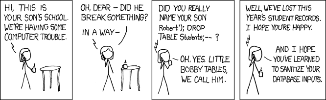

## `api.py` is the contract

It says what a request is and what an answer is, as Pydantic models. 

- `SystemOneRequest`: a state, and questions by name
- `render`: turn any JSON value into the text the model reads
- `to_record`: turn a request into the record the model is given
- `to_answers`: turn the model's probabilities back into answers

---

## Three kinds of question, one mechanism

| Kind | You give | You get back |
|---|---|---|
| `noul` | a yes-or-no question | the probability of yes |
| `choice` | named options, each with a description | the most probable option, a confidence, every probability |
| `score` | ordered levels | the expected level, a confidence, every probability |

Each becomes a list of options. The model only ever points at one option in a list.

---

## Pydantic: types checked when the data arrives

```python
class Score(BaseModel):
    type: Literal["score"]
    instructions: JSONContent
    criteria: list[JSONContent] = Field(min_length=2, max_length=MAX_OPTIONS)
```

- A **named** class says what the data must look like. Pydantic validates on this.
- Validation happens before the code runs. 
- Look at sample data in `data/cheese/sample.jsonl`. 

---

## Check what comes in



xkcd.com/327, *Exploits of a Mom*. CC BY-NC 2.5

---

## pytest: a test is a function that asserts

**Kind: unit**: one function, alone. Every test at this step is a unit test; the other kinds come with the model.

```python
def test_choice_confidence_is_zero_for_a_guess() -> None:
    assert choice_confidence([0.25, 0.25, 0.25, 0.25]) == 0.0
```

- `tests/unit/test_*.py`. `just test` runs them all, `just test -k confidence` some
- Every run measures coverage: which lines of `src/babykev` the tests reached
- At step 01: 52 runs, 50 pass, **2 fail**. Coverage 100%
- What to test: normal inputs, edge cases, invalid inputs. Both failing tests are edge cases, a pure guess and 77 options. pydantic refuses invalid inputs

---

## Testing the command: fixtures and parametrize

**Kind: unit**: `main`, alone, with the words it would get from a terminal.

```python
def run(monkeypatch, *words):
    monkeypatch.setattr("sys.argv", ["babykev", *words])
    main()

@pytest.mark.parametrize("words", [(), ("help",), ("--help",), ("-h",)])
def test_help_is_printed_for_help_and_for_no_words(monkeypatch, capsys, words):
    run(monkeypatch, *words)
    assert capsys.readouterr().out == HELP
```

- **Fixtures**: `monkeypatch` and `capsys` are two of pytest's built-in fixtures. A test names them as arguments, and pytest passes them in. Our own fixtures come with the model
- `monkeypatch` sets `sys.argv` as if `babykev help` had been typed, and reverts it after the test
- `capsys` catches what the program printed, so the test can compare it with `HELP`
- **`@pytest.mark.parametrize`** runs the function once for each value of `words`: one function, four tests. `just test -k help_is_printed -v` lists them, `[words0]` to `[words3]`

---

## Two tests fail, and the tests are right

**Kind: unit**, both: one function each.

```python
def test_score_confidence_is_zero_for_a_guess():
    assert score_confidence([1 / 3] * 3) == pytest.approx(0)
```

**A pure guess over three levels reported confidence 0.5.** A guess should have confidence 0. Confidence runs from 1, when the model is sure, down to 0, when it knows nothing. A model that gives every level the same chance knows nothing. pytest: `assert 0.5 == 0 ± 1.0e-12`

$ sed -n '82,86p' src/babykev/api.py
$ just test -k score_confidence_is_zero

```python
def test_rounded_probabilities_still_sum_to_one():
    keys = [f"intent{i}" for i in range(77)]
    answer = to_answers([[1 / 77] * 77], [{"id": "intent", "type": "choice", "keys": keys}])[
        "intent"
    ]
    assert sum(answer["probabilities"].values()) == pytest.approx(1, abs=0.02)
```

**77 equally likely options, each rounded to two decimals, summed to 0.77.** Probabilities sum to 1. pytest: `assert 0.77 == 1 ± 0.02`

$ sed -n '89,90p;99p' src/babykev/api.py
$ just test -k rounded_probabilities

kev found and fixed both, days later. A test written on the first day finds on the first day what a user would have found later.
