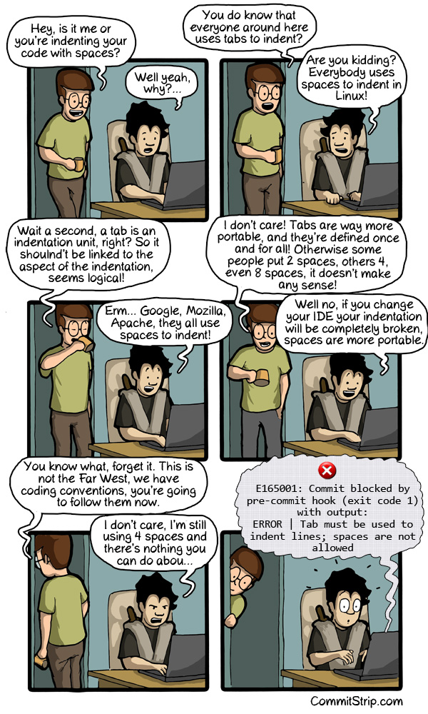
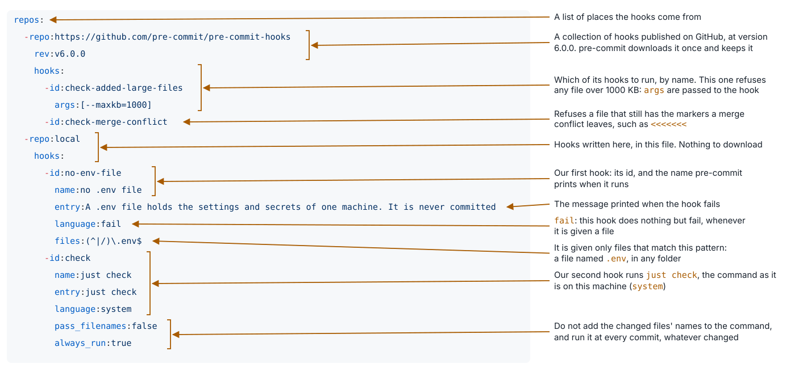

## A person (agent) needs to remove the remaining errors

There were 36 lint errors the tools could not fix:

- we needed one-line docstrings on every class and function
- there were missing types on test arguments, on returns
- names a reader can say: `K` and `L` became `k` and `n`
- one more test, for a score with a single level

Result: 53 tests, coverage 100%, 0 findings.

---

## What `pre-commit install` writes

`just setup` runs `pre-commit install`, which writes one file, `.git/hooks/pre-commit`:

```bash
#!/usr/bin/env bash
# File generated by pre-commit: https://pre-commit.com
INSTALL_PYTHON=/Users/rahul/Projects/babykev-replay/.venv/bin/python3
ARGS=(hook-impl --config=.pre-commit-config.yaml --hook-type=pre-commit)
...
if [ -x "$INSTALL_PYTHON" ]; then
    exec "$INSTALL_PYTHON" -mpre_commit "${ARGS[@]}"
```

- Before every commit, git looks in `.git/hooks/` for a file named `pre-commit`, and runs it if it is there
- This file only hands over: it starts pre-commit, from this folder's `.venv`, and tells it which config to read
- The path is this machine's, so the file is never committed. Every clone runs `just setup` to write its own
- Any program in that place would do. Two lines, `#!/bin/sh` and `just check`, would work. pre-commit adds the config file, the hooks it downloads, and the install

---

## `just check`: everything a commit must pass

```
just fmt --check
just lint
just test -q --cov-fail-under=90
just lint-config
```

- Coverage below 90% fails the check
- `just lint-config` checks the files that are not Python: every YAML file, `pyproject.toml`, the lockfile against it, and the justfile's own format

---

## `just lint-config`: the files that are not Python

Four checks, one for each kind of file:

| Check | The file it reads | New package? |
|---|---|---|
| `yamllint --strict .` | every YAML file, such as `.pre-commit-config.yaml` | yes |
| `validate-pyproject pyproject.toml` | `pyproject.toml` | yes |
| `uv lock --check` | `uv.lock`, against `pyproject.toml` | no, uv |
| `just --fmt --check --unstable` | the `justfile` | no, just |

`just --show lint-config` prints the recipe:

```
# Lint the config files: the YAML files, pyproject.toml, the lockfile and this justfile
[group('quality')]
[no-exit-message]
lint-config *args:
    #!/usr/bin/env sh
    set -e
    if [ "$*" = help ]; then just help lint-config; exit 0; fi
    uv run yamllint --strict .
    uv run validate-pyproject pyproject.toml
    uv lock --check
    just --fmt --check --unstable
```

`set -e` stops at the first check that fails.

---

## yamllint: checks every YAML file

```yaml
# .yamllint, its settings
extends: default
ignore-from-file: .gitignore
rules:
  line-length: {max: 100}
  document-start: disable  # a file need not start with a line of three dashes
```

- `uv run yamllint --strict .` reads every YAML file in the repository. When all is well it prints nothing
- `--strict` makes a warning count as a failure, not only an error
- One line of `.pre-commit-config.yaml` indented two spaces too far: `10:15 error syntax error: mapping values are not allowed here (syntax)`. Line 10, column 15
- A broken hook config would break every commit. yamllint sees it first

---

## validate-pyproject: checks `pyproject.toml`

- `pyproject.toml` has an agreed format, written down as a standard: which sections there are, which keys each may hold, and what kind of value each key takes
- `uv run validate-pyproject pyproject.toml` checks the file against it. When all is well: `Valid file: pyproject.toml`
- One key misspelt, `requires_python` instead of `requires-python`:

```
`project` must not contain {'requires_python'} properties
Invalid file: pyproject.toml
```

---

## `uv lock --check`: is the lockfile up to date?

- No new package: uv is already here. `--check` only compares `uv.lock` with `pyproject.toml` and changes nothing
- When they agree: `Resolved 29 packages`
- Raise pydantic's lowest allowed version in `pyproject.toml` from 2.11 to 2.12, and do not run `uv lock`:

```
error: The lockfile at `uv.lock` needs to be updated, but `--check` was provided.

hint: To update the lockfile, run `uv lock`.
```

---

## `just --fmt --check`: is the justfile formatted?

- No new package: just has its own formatter. `--unstable` is needed because just still marks the formatter as unstable
- When the justfile is formatted, it prints nothing
- Write `program:="babykev"` with no spaces, and it prints the justfile as a diff, 70 lines. Two of them carry the change, and the last says why it failed:

```
-program:="babykev"
+program := "babykev"
...
error: Formatted justfile differs from original.
```

---

## pre-commit: the checks run themselves

- Running every check by hand before each commit gets tiring, and gets forgotten
- A git hook runs before every commit, and refuses the commit if a check fails
- **The hook runs `just check`.** The hook and your terminal run the same thing
- Two more hooks refuse a file over 1 MB and a `.env` file
- `just setup` installs the hook, so nobody has to remember

A commit that fails the check does not happen.

---

## The indentation question



CommitStrip, *The Indentation Question*, 14 February 2013, commitstrip.com

---

## The hook's config, line by line



---

## Other moments git can run a hook

A hook is a script git runs at a moment of its own. It lives in `.git/hooks/`, which is not part of the repository, so every clone installs its own: `just setup` does it for us.

| Hook | When git runs it | What it is for |
|---|---|---|
| `pre-commit` | before a commit is made | refuse what must not go in. **Ours** |
| `commit-msg` | on the message, before the commit is made | require a shape for the message |
| `pre-push` | before a push | checks too slow to run on every commit |
| `post-checkout`, `post-merge` | after moving to another commit | follow the move, for example update the environment |
| `prepare-commit-msg`, `pre-rebase`, `post-commit` | around a commit | templates, guards, notices |

A hook is like a callback in a training loop: code that runs at a set moment. These hooks run on your machine; a server such as GitHub can run hooks of its own when you push, called server-side hooks.

We use one, `pre-commit`. The others wait until something needs them.

pre-commit is one tool among several that install hooks: husky (for JavaScript projects), lefthook, overcommit. Or none: a script you write yourself in `.git/hooks/`, or a folder of scripts in the repository that `git config core.hooksPath` points git to.
