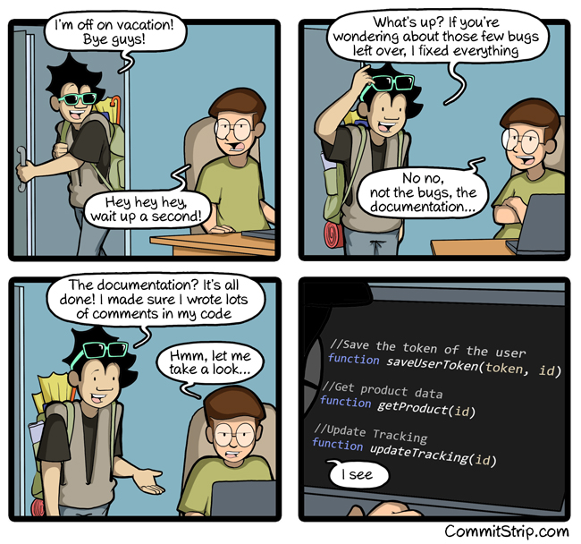

## Documentation, just before a holiday



CommitStrip, *Documentation just before vacation*, 27 July 2016, commitstrip.com

---

## The program documents itself

| Command | Prints |
|---|---|
| `babykev docs list` | every module, class and function, one line each |
| `babykev docs module api` | one module as plain Markdown |
| `babykev docs check` | what is typed and documented, and every gap. Exit 1 if any |

- Plain Markdown, no links: for people at a terminal, and for agents
- fastcore's `docments` reads the comments beside the parameters

---

## Types and docs, written once

```python
def line_of(
    sym: Code,  # A function, method or class
) -> int:  # The line its definition starts on
    """Find the line a symbol's definition starts on, to keep symbols in source order."""
```

- The **type** is in the signature
- The **meaning** is in a comment beside each parameter: a **docment**
- The **docstring** says what the function is for
- Nothing is written twice, so nothing can disagree

---

## The gaps

`just docs check` holds every function to one rule: every parameter typed and with a comment, the return typed and with a comment unless it is `None`, a docstring, and a description on every model field.

| File | Typed and documented |
|---|---|
| `babykev.docs` | 26 of 26 |
| `babykev.cli` | 1 of 1 |
| `babykev.api` | 0 of 12 |
| `test_api.py` | 23 of 29 |
| `test_cli.py` | 0 of 4 |
| `test_docs.py` | 0 of 16 |

- 50 of 88, and 84 gaps: 62 parameters and 10 returns with no comment, 11 model fields with no description, 1 method with no docstring
- Only `babykev.docs`, the documentation tool itself, came with its comments written. The rest get theirs at step 04b
- `just check` does not run `docs check` yet. If it did, the hook would refuse this commit, because `docs check` fails here

---

## The site is built from the same text

- `docs/apidocs.py` writes a reference page per module from `babykev docs`, before every render
- Quarto renders the site into `docs/_site/`. `just docs` builds it
- A name in backticks becomes a link to its entry

---

## Docments and the formatter

- The formatter never joins a line that carries a comment, so docments survive `just fmt`
- One way to lose one: a line longer than 100 characters. The formatter wraps it, and the comment lands away from its parameter
- Only `docs check` notices. So lines stay at 100

---

## Step 04b: every function documented

- 84 gaps filled: 72 docments, 11 field descriptions, 1 docstring. 18 of the docments are in `api.py`, 54 in the tests
- `docs check`: 88 of 88
- `just docs check` joins `just check`. From now on, the hook refuses a commit with any gap

---

## What documented code looks like

```python
def render(
    v: JSONContent,  # Text, a number, a list or an object, from a request
    indent: int = 0,  # How deeply nested this value is; each level indents by two spaces
) -> str:  # The text the model sees
```

- The type says `int`; the docment says what the number means. A docment is for what the type cannot say

```python
class Noul(BaseModel):
    type: Literal["noul"] = Field(description="Marks the question as yes-or-no")
```

- A pydantic model has no signature to put a comment on, so each field carries `description=`. `docs check` reads it the way it reads a docment
