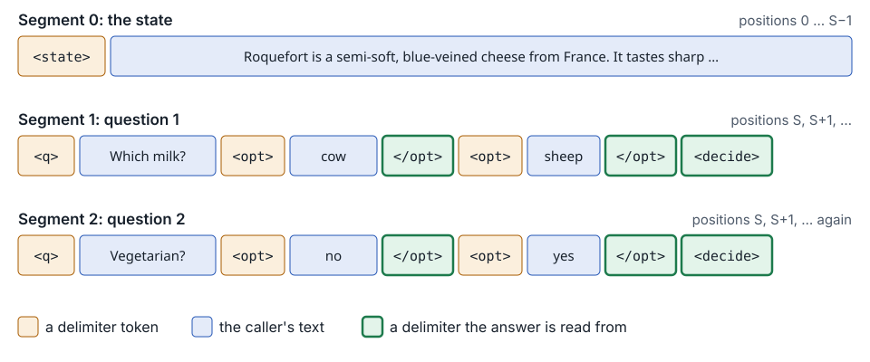
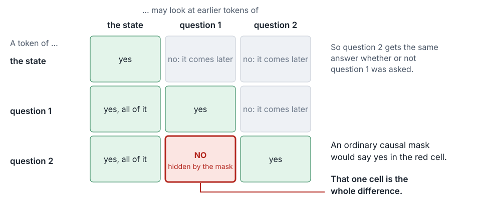
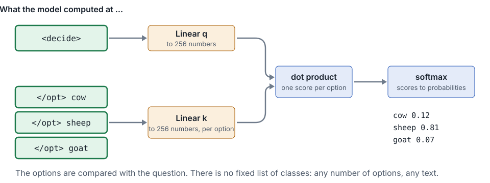

## `model.py`: four ideas

- **Pack** the state and every question into one sequence
- **Mask** it, so each question sees the state and itself, never another question
- **Restart the positions**, so every question sits right after the state
- **Point**: score each option against the question's decision token

One forward pass answers every question, as if each had been asked alone.

---

## Packing: one sequence for everything



Five delimiter tokens mark the parts. A caller's text can never produce one.

---

## The mask: questions cannot see each other



```python
attend(i, j)  if  j <= i  and  (seg[j] == 0  or  seg[j] == seg[i])
```

---

## The pointer head: compare, do not classify



---

## What is trained

| Part | Parameters | Trained? |
|---|---|---|
| Qwen2.5-0.5B, the language model | about 494 million | No. Frozen |
| The LoRA adapter, rank 16 | about 8.8 million | Yes |
| The pointer head | about 0.5 million | Yes |

The smoke prints it: 503M parameters, 9.3M of them trainable.

---

## Tests with no download: the tiny model

- A tokenizer with one token per character, and a backbone of Qwen's architecture with two layers and 32 dimensions, built in memory with random weights
- The properties we test (packing, the mask, the head) hold for any weights
- No download, no GPU, a few seconds. So they run on every commit

**Hermetic**: only our code can make these tests fail. No network, no download, no device.

---

## ty: a type checker

- It reads every call against what the called function declares, before anything runs
- At step 05 it arrives, and `just types` names two places in `model.py`, written the way kev wrote them
- It is not in `just check` yet. A tool arrives before it gates

---

## The smoke: everything, on the real model

`just smoke local` loads Qwen2.5-0.5B with a fresh adapter and an untrained head, asks the 15 sample questions, and prints each answer beside its label.

- On this Mac's GPU: 6 of 15 right
- Every check is green

Something is wrong, and nothing we have can see it.
