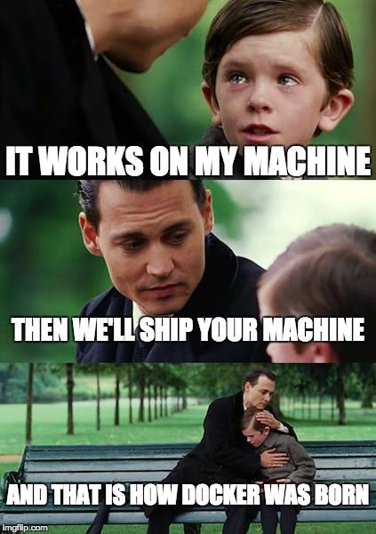
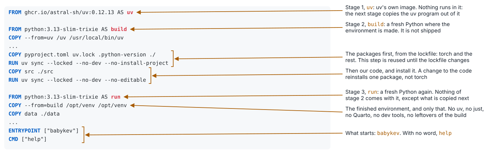
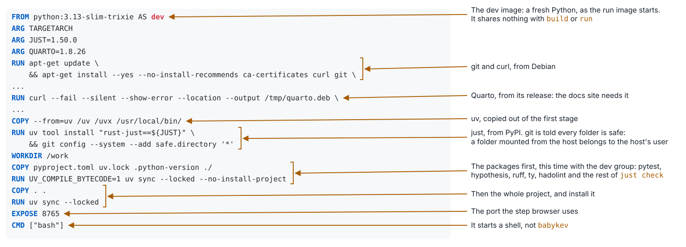
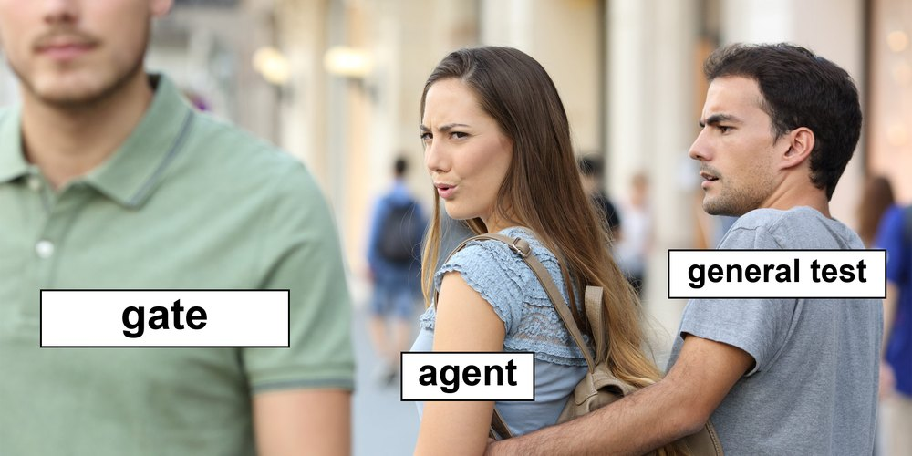

## Not everyone has a Mac

- Students run Windows, Linux, WSL, or a VM in the cloud
- The platforms we train on are Linux machines in someone else's building
- An image is a Linux machine described in one file, the `Dockerfile`, and built anywhere Docker runs

---

## How Docker was born



A widely shared meme; its author is unknown. imgflip.com/i/24ac74

---

## Two images from one lockfile

| | dev | run |
|---|---|---|
| Contains | every dependency with the dev tools, uv, just, Quarto, git | Python and what the program needs |
| Starts | a shell, with your folder mounted | `babykev` |
| For | working on the project on any system, and CI | a platform that runs the program |
| Size | 1.84 GB | 1.15 GB |

The packages are installed first and the code after, so a change to the code does not reinstall torch.

---

## The run image is built in stages, and only the last one ships



`docker build --target run` stops at the stage named `run`.

---

## The dev image: the same Python, with the tools



`docker build --target dev` needs only the first stage, `uv`, and none of `build` or `run`.

---

## `just image`

```
just image build dev        the dev image, named by the commit
just image shell            a new container of it: then just check, as on the Mac
just image start            or one kept running; shell goes into it, stop ends it
just image run smoke        the smoke in the run image
```

- An image is a file on disk. A container is a running copy of it
- `just` runs on your machine, and it runs `docker`. In the run image there is no `just`: the container runs `babykev`, so `just image run smoke` ends up as `babykev smoke` in the container
- The dev image has `just`. `just image shell` gives a shell in it, and there every recipe works, as on the Mac: `just check` is green, `just smoke local` gives 4 of 15 on the CPU, and `git` works in the mounted folder
- In the run image, on the CPU: 4 of 15, the same fifteen answers as on the Mac's GPU, line for line. Eight times slower

---

## hadolint: a linter for Dockerfiles

It reads the `Dockerfile` and names the rules it breaks. On our file it says nothing. It found two things in the first draft.

**1. Two `RUN` lines in a row.** Lines 68 and 69 are one `RUN`: the `just` install and the `git` setting, joined with `&&`. Split them in two, and hadolint says:

```
$ uv run hadolint Dockerfile
Dockerfile:69 DL3059 info: Multiple consecutive `RUN` instructions. Consider consolidation.
```

We fixed it: one `RUN`.

**2. Debian packages without a pinned version.** Delete the line that declines the rule, and hadolint says:

```
$ uv run hadolint Dockerfile
Dockerfile:48 DL3008 warning: Pin versions in apt get install. Instead of `apt-get install <package>` use `apt-get install <package>=<version>`
```

We declined it, and said why beside the line, lines 46 to 48.

- A linter's rule is a default, not a law
- It is a line of `just lint-config`, so the hook runs it

---

## What should not go in the hook?

Along the way we added a check at almost every step: format, lint, types, the tests, the docs, the config files. `just check` runs all of them, and the commit hook runs `just check`. So should everything go in?

- A check that needs the network, a download, a GPU or a lot of time can fail for reasons outside our code
- A hook that fails for those reasons cannot be trusted, and people learn to skip it
- So the question for every check: can anything but our code make it fail? Only the checks where the answer is no belong in the hook

The next slides sort our tests by that question.

---

## Kinds of tests, and which can run on every commit

| Kind | What runs | Ours | Is ours hermetic? |
|---|---|---|---|
| Unit | one function | a confidence function on a list of numbers | yes |
| Integration | several of our parts together, with stand-ins for what comes from outside | packing, the mask, the model and the head; and the whole smoke. Both on the tiny model | yes: the tiny model stands in for the real one |
| End-to-end, or system | the whole program with its real parts, as a user runs it | the smoke on the real model, from the Hub: `test_real_model.py` | no |
| Smoke | a quick end-to-end run: does it start and answer at all? | the same smoke on the real model, by hand: `just smoke local` | no |
| Acceptance | does it meet a requirement, such as an answer within 50 ms | none yet | |

- An end-to-end test uses the real parts, so something outside our code can make it fail: it is never hermetic. An integration test is hermetic only when what comes from outside is replaced
- pytest has no built-in kinds. You name your own markers in `pyproject.toml`, put `@pytest.mark.NAME` on a test, and choose with `-m NAME`
- Our one marker is `system`. It is on the one test that is end-to-end: the smoke on the real model

---

## 2 unit tests, 0 integration tests


Made popular by Randal Olson, January 2016; the clip's author is unknown. giphy.com/gifs/2-unit-tests-0-integration-3o7rbGT9rrEJa4Y5LG

---

## Hermetic, by experiment

The smoke on the real model is now a test too, marked `system`. `just test` leaves it out.

The mask and isolation tests of step 05a are integration tests by kind, and they have no marker: they are hermetic, so they run at every commit. The marker `system` is only on the one test that is not hermetic: the smoke on the real model, which is a system test.

| With `--network none` | Result |
|---|---|
| `just check` | passes |
| `just test -m system`, the model in the cache | passes |
| the same, with an empty cache | fails: it cannot reach the Hub |

What still passes with the network pulled can run on every commit.

---

## A test is anything that can fail and stop you

More generally, a test is anything that can fail and stop a commit. All of these are tests in that sense:

| What is checked | How | Recipe | On every commit? |
|---|---|---|---|
| Functions, the mask, the model | pytest, hypothesis, the tiny model | `just test` | yes |
| Types | ty | `just types` | yes |
| Documentation | `babykev docs check` | `just docs check` | yes |
| Format and lint | ruff | `just fmt --check`, `just lint` | yes |
| Config files, the Dockerfile | yamllint, validate-pyproject, uv, hadolint | `just lint-config` | yes |
| The real model, from the Hub | the smoke, marked `system` | `just test -m system` | no: not hermetic |

Most of these are not pytest. All of them are `just`.

---

## You may even call it a gate



Distracted girlfriend, a widely shared stock photo (imgflip.com/memetemplate/118429510). The labels are ours

---

## The docs, published

- The site holds the reference pages of each module and, since step 05a, a Guide: the model in four ideas, and the mask as a grid in a notebook
- `just docs publish` builds the site and pushes it to the `gh-pages` branch
- GitHub Pages serves it: rahuldave.github.io/babykev
- The built site never enters `main`
