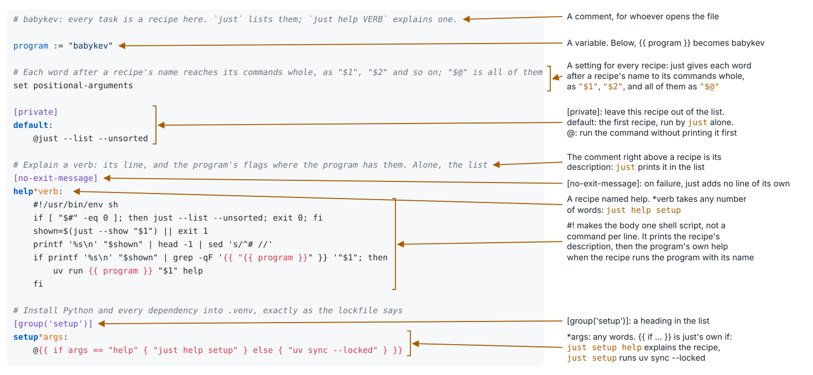
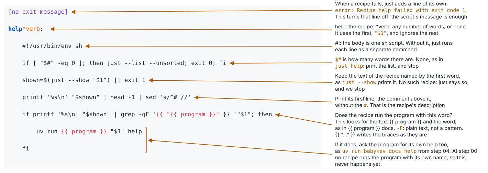

## just: the project's interface

```just
# Install Python and every dependency into .venv, exactly as the lockfile says
setup:
    uv sync --locked
```

- A recipe is a named command. `just setup` runs it
- `just` alone lists every recipe, with the comment above it
- `just --show setup` prints what is behind the name

Whoever calls a recipe does not need to know what is behind it. When the command changes, the call does not.

---

## Why automate


xkcd.com/1319, *Automation*. CC BY-NC 2.5

---

## The justfile, line by line



---

## The help recipe, line by line



```
$ just help setup
Install Python and every dependency into .venv, exactly as the lockfile says

$ just help nosuch
error: Justfile does not contain recipe `nosuch`
```

---

## How to ask what a recipe does

```
just                 the list, grouped
just help test       one recipe: its line, and the program's own help where there is one
just test help       the same, the other way round
just --show test     the recipe itself
```

- Extra words go to the tool behind the recipe: `just test -k render` passes `-k render` to pytest
- People, agents, the git hook and CI all run the same recipes
